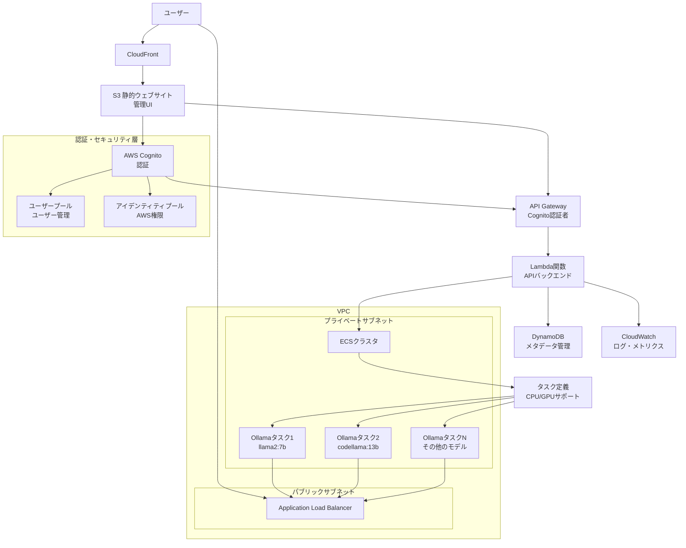
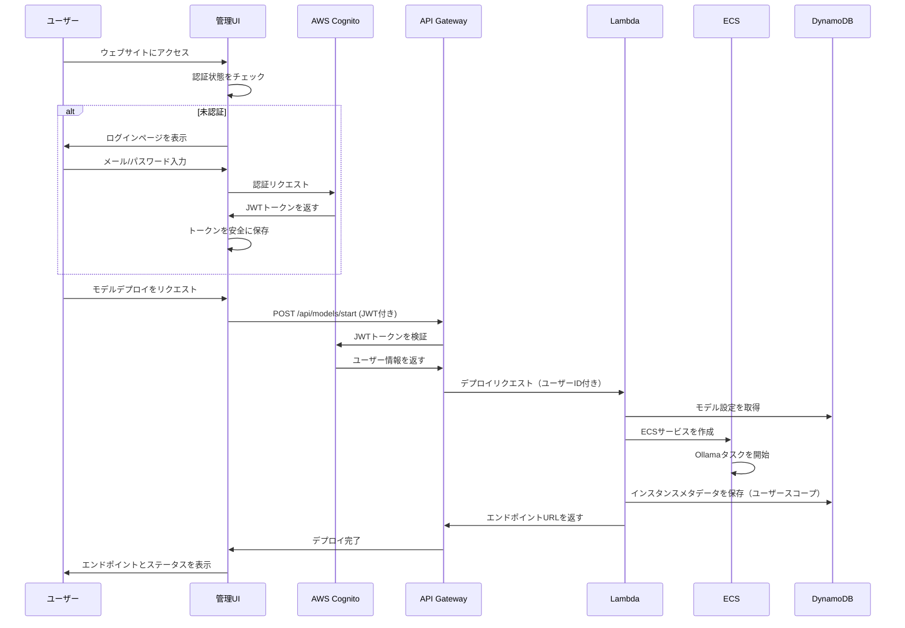

# AWS Ollama LLM プラットフォーム

[🇯🇵 日本語版README](./README.ja.md) | [🇺🇸 English README](./README.md)

🚀 **セキュアな認証機能とワンクリックCloudFormationセットアップによる動的Ollama LLMのAWSデプロイメント**

[](https://opensource.org/licenses/Apache-2.0)
[](https://aws.amazon.com/)
[](https://ollama.com/)
[](https://aws.amazon.com/cognito/)

## 🎯 概要

このプロジェクトは、Ollama大規模言語モデル（LLM）を動的にデプロイ・管理するための完全なAWSベースソリューションを提供します。ユーザーは、完全な認証機能、自動エンドポイント生成、包括的なモニタリングを備えた安全なWebベースの管理インターフェースを通じて、任意のモデルとインスタンスタイプを選択できます。

**主要機能:**
- 🔒 **セキュアな認証**: AWS Cognitoによるユーザー管理
- 🔄 **動的LLMデプロイメント** ECS（Fargate/EC2）経由
- 🖥️ **Webベース管理ダッシュボード**（React.js）
- ⚡ **需要に基づく自動スケーリング**
- 💰 **自動アイドルシャットダウンによるコスト最適化**
- 🛡️ **プライベートサブネットを使用したセキュアVPC構成**
- 📊 **包括的なモニタリング**とログ記録
- 🎯 **ワンクリックCloudFormationデプロイメント**

## 🏗️ アーキテクチャ



## 🚀 クイックスタート

### 前提条件
- 適切な権限を持つAWSアカウント
- 設定済みのAWS CLI
- ドメイン名（オプション、カスタムエンドポイント用）
- 管理者アカウント用のメールアドレス

### 1. インフラストラクチャのデプロイ

```bash
# リポジトリをクローン
git clone https://github.com/clf13092/aws-ollama-llm-platform.git
cd aws-ollama-llm-platform

# パラメータファイルを作成
cat > parameters.json << EOF
[
  {
    "ParameterKey": "Environment",
    "ParameterValue": "production"
  },
  {
    "ParameterKey": "DomainName",
    "ParameterValue": "ollama.yourdomain.com"
  },
  {
    "ParameterKey": "AdminEmail",
    "ParameterValue": "admin@yourdomain.com"
  },
  {
    "ParameterKey": "EnableMFA",
    "ParameterValue": "false"
  }
]
EOF

# スタックをデプロイ
aws cloudformation create-stack \
  --stack-name aws-ollama-platform \
  --template-body file://cloudformation/main.yaml \
  --parameters file://parameters.json \
  --capabilities CAPABILITY_IAM CAPABILITY_NAMED_IAM

# 初期管理者ユーザーを作成（スタックデプロイ完了後）
aws cognito-idp admin-create-user \
  --user-pool-id <USER_POOL_ID> \
  --username admin \
  --user-attributes Name=email,Value=admin@yourdomain.com \
  --temporary-password TempPass123! \
  --message-action SUPPRESS
```

### 2. 管理インターフェースへのアクセス

デプロイ完了後（約15-20分）：

1. **スタック出力からCloudFront URLを取得**
2. **ブラウザで管理インターフェースを開く**
3. **管理者認証情報でログイン**：
   - ユーザー名: `admin`
   - 一時パスワード: `TempPass123!`
4. **プロンプトに従って永続パスワードを設定**
5. **ダッシュボードにアクセス**してLLMモデルを管理

### 3. 最初のモデルをデプロイ

1. **ダッシュボードにログイン**
2. **「モデル」セクションに移動**
3. **モデルを選択**（例：Llama2 7B、CodeLlama 13B）
4. **インスタンスタイプを選択**（要件に応じてCPU/GPU）
5. **「モデルをデプロイ」をクリック**
6. **インスタンス一覧からAPIエンドポイントURLを取得**

## 🔒 認証・セキュリティ

### AWS Cognito設定
- **ユーザープール**: メール認証付きの集中ユーザー管理
- **パスワードポリシー**: 8文字以上、大小文字混在、数字、記号
- **アカウントセキュリティ**: 5回失敗後の自動ロックアウト
- **MFAサポート**: オプションのSMS/TOTP認証
- **セッション管理**: 設定可能な有効期限を持つJWTトークン

### アクセス制御
- **ロールベース権限**：
  - **管理者**: システム全体へのアクセスとユーザー管理
  - **ユーザー**: 個人モデル管理のみ
  - **読み取り専用**: モデルとログの表示のみ
- **API保護**: すべての管理APIで有効なJWTトークンが必要
- **リソース分離**: ユーザーは自分のデプロイしたモデルのみアクセス可能

### セキュリティ機能
- **全体的HTTPS**: すべての通信で転送中暗号化
- **VPC分離**: プライベートサブネット内のコンピューティングリソース
- **ネットワークセキュリティ**: 最小権限アクセスのセキュリティグループ
- **IAMポリシー**: すべてのAWSリソースで最小権限の原則

## 📊 コンポーネント詳細

### フロントエンド（管理UI）
- **技術**: React.js + TypeScript + Material-UI + AWS Amplify Auth
- **ホスティング**: S3静的ウェブサイト + CloudFront CDN
- **機能**:
  - **メール認証付きセキュアログイン/サインアップ**
  - **認証ユーザーのみの実行中モデル概要ダッシュボード**
  - **リアルタイムステータス付きモデルデプロイメントインターフェース**
  - **エンドポイント管理**とテスト機能
  - **リアルタイムモニタリング**とログ表示
  - **パスワード変更とMFA設定付きユーザープロファイル管理**

### バックエンドAPI
- **技術**: AWS Lambda + Python（FastAPI）+ boto3
- **認証**: API Gateway Cognito認証者 + JWT検証
- **データベース**: ユーザースコープ付きデータアクセスのDynamoDB
- **エンドポイント**:

```bash
# パブリックエンドポイント（認証不要）
POST   /api/auth/login          # ユーザーログイン
POST   /api/auth/signup         # ユーザー登録
POST   /api/auth/reset-password # パスワードリセット

# 保護されたエンドポイント（JWTトークン必要）
GET    /api/models              # 利用可能モデル一覧
POST   /api/models/start        # 新モデルデプロイ（ユーザースコープ）
DELETE /api/models/{id}/stop    # 実行中モデル停止（所有者のみ）
GET    /api/instances           # ユーザーの実行中インスタンス一覧
GET    /api/instances/{id}      # インスタンス詳細・エンドポイント取得
GET    /api/instances/{id}/logs # インスタンスログ取得
GET    /api/user/profile        # ユーザープロファイル取得
PUT    /api/user/profile        # ユーザープロファイル更新
GET    /api/health              # システムヘルスチェック
```

### コンテナプラットフォーム
- **ECSクラスタ**: Fargate（CPU）+ EC2（GPU）の混合デプロイメント
- **オートスケーリング**: コスト最適化付きリクエストベーススケーリング
- **サービスディスカバリ**: 内部サービス通信用AWS Cloud Map
- **ロードバランシング**: ヘルスチェック付きApplication Load Balancer
- **ユーザー分離**: 各ユーザーのモデルは別々の名前空間でデプロイ

## 🔧 サポートモデル

| モデル | サイズ | CPUサポート | GPUサポート | 必要メモリ | デプロイ時間 |
|-------|------|-------------|-------------|------------|-------------|
| Llama2 | 7B | ✅ | ✅ | 4GB | 約3分 |
| Llama2 | 13B | ✅ | ✅ | 8GB | 約5分 |
| CodeLlama | 7B | ✅ | ✅ | 4GB | 約3分 |
| CodeLlama | 13B | ✅ | ✅ | 8GB | 約5分 |
| Mistral | 7B | ✅ | ✅ | 4GB | 約3分 |
| Mistral | 7B Instruct | ✅ | ✅ | 4GB | 約3分 |

## 💡 使用例

### 認証フロー
```bash
# 1. ユーザー登録
curl -X POST https://api.ollama.yourdomain.com/api/auth/signup \
  -H "Content-Type: application/json" \
  -d '{
    "email": "user@example.com",
    "password": "SecurePass123!",
    "confirmPassword": "SecurePass123!"
  }'

# 2. ログインしてJWTトークンを取得
response=$(curl -X POST https://api.ollama.yourdomain.com/api/auth/login \
  -H "Content-Type: application/json" \
  -d '{
    "email": "user@example.com",
    "password": "SecurePass123!"
  }')

# JWTトークンを抽出
jwt_token=$(echo $response | jq -r '.access_token')
```

### 認証済みAPI使用
```bash
# 利用可能モデル一覧（認証必要）
curl https://api.ollama.yourdomain.com/api/models \
  -H "Authorization: Bearer $jwt_token"

# Llama2モデルをデプロイ
curl -X POST https://api.ollama.yourdomain.com/api/models/start \
  -H "Authorization: Bearer $jwt_token" \
  -H "Content-Type: application/json" \
  -d '{
    "model_id": "llama2-7b",
    "instance_type": "ml.m5.large"
  }'

# 実行中インスタンス一覧
curl https://api.ollama.yourdomain.com/api/instances \
  -H "Authorization: Bearer $jwt_token"

# デプロイしたモデルとチャット
curl https://ollama-inst-001.yourdomain.com/api/generate \
  -H "Content-Type: application/json" \
  -d '{
    "model": "llama2",
    "prompt": "こんにちは、元気ですか？",
    "stream": false
  }'
```

### 認証済みモデルワークフロー



## 🛡️ セキュリティベストプラクティス

### インフラストラクチャセキュリティ
- **VPC分離**: プライベートサブネット内のすべてのコンピューティングリソース
- **セキュリティグループ**: 最小限の必要ポートによるネットワークレベルアクセス制御
- **IAMポリシー**: すべてのAWSリソースの最小権限原則
- **暗号化**: 転送中および保存時のデータ暗号化

### アプリケーションセキュリティ
- **JWTトークン**: 設定可能な有効期限付きセキュア認証
- **入力検証**: すべてのAPI入力の検証とサニタイズ
- **レート制限**: 悪用からのAPIエンドポイント保護
- **監査ログ**: セキュリティモニタリング用全ユーザーアクションログ

### 運用セキュリティ
- **自動更新**: コンテナイメージの定期セキュリティパッチ
- **モニタリング**: リアルタイムセキュリティイベントモニタリング
- **バックアップ**: ユーザーデータと設定の自動バックアップ
- **インシデント対応**: セキュリティイベントの自動アラート

## 💰 コスト最適化

- **自動シャットダウン**: 設定可能なタイムアウト後のアイドルインスタンス停止
- **スポットインスタンス**: 開発ワークロード用オプション（最大90%節約）
- **適正サイジング**: モデル要件に基づく自動CPU/GPU選択
- **従量課金**: モデルが実際に実行中の時のみ課金
- **リソースモニタリング**: リアルタイムコスト追跡とアラート

## 📈 モニタリング・可観測性

### CloudWatchメトリクス
- **システムメトリクス**: ECS CPU/メモリ使用率、ALB応答時間
- **アプリケーションメトリクス**: API Gatewayリクエスト数、Lambda実行時間
- **ビジネスメトリクス**: アクティブユーザー、モデルデプロイ成功率
- **コストメトリクス**: ユーザー・モデル別リアルタイムコスト追跡

### ログ・アラート
- **集中ログ**: CloudWatch Logsでのすべてのログ集約
- **セキュリティモニタリング**: 認証失敗、異常なアクセスパターン
- **パフォーマンスアラート**: 高遅延、エラー率、リソース枯渇
- **コストアラート**: 支出しきい値と予算通知

## 🛠️ 開発・デプロイメント

### プロジェクト構造
```
├── cloudformation/           # Infrastructure as Code
│   ├── main.yaml            # マスターテンプレート
│   ├── network/             # VPC、サブネット、ゲートウェイ
│   ├── compute/             # ECSクラスタ、タスク定義
│   ├── api/                 # Lambda関数、API Gateway
│   ├── auth/                # Cognitoユーザープール・アイデンティティプール
│   ├── storage/             # DynamoDBテーブル
│   ├── frontend/            # S3、CloudFront
│   └── security/            # IAMロールとポリシー
├── src/
│   ├── frontend/            # 認証付きReact管理UI
│   ├── api/                 # Lambda関数コード
│   └── containers/          # カスタムOllama Dockerイメージ
├── docs/                    # ドキュメント
└── scripts/                 # デプロイメントとユーティリティスクリプト
```

### ローカル開発
```bash
# 依存関係をインストール
npm install

# Cognito用AWS認証情報を設定
export AWS_REGION=us-east-1
export COGNITO_USER_POOL_ID=<your-user-pool-id>
export COGNITO_CLIENT_ID=<your-client-id>

# 認証付きフロントエンドをローカル実行
cd src/frontend
npm start

# Lambda関数をデプロイ
cd src/api
sam deploy
```

## 🔮 ロードマップ

### セキュリティ強化
- [ ] **SSO統合**: エンタープライズ認証用SAML/OIDCサポート
- [ ] **APIキー管理**: 自動アクセス用長期APIキー
- [ ] **監査ダッシュボード**: 包括的なセキュリティ・アクセスモニタリング

### プラットフォーム機能
- [ ] **マルチリージョンデプロイメント**: 低遅延のためのグローバル配布
- [ ] **ファインチューニング機能**: カスタムモデルトレーニングとデプロイメント
- [ ] **モデルバージョニング**: A/Bテストとロールバック機能
- [ ] **バッチ推論**: 高スループットバッチ処理
- [ ] **チーム管理**: 組織・チームベースアクセス制御

### 統合
- [ ] **Webhookサポート**: 外部システム統合と通知
- [ ] **Slack/Teamsボット**: モデル管理用ChatOps統合
- [ ] **CI/CD統合**: 自動モデルデプロイメントパイプライン

## 🤝 貢献

貢献を歓迎します！詳細は[CONTRIBUTING.md](CONTRIBUTING.md)をご覧ください。

### セキュリティ開示
セキュリティ脆弱性を発見した場合は、パブリックイシューを開く代わりにsecurity@yourdomain.comにメールしてください。

1. リポジトリをフォーク
2. フィーチャーブランチを作成（`git checkout -b feature/AmazingFeature`）
3. 変更をコミット（`git commit -m 'Add some AmazingFeature'`）
4. ブランチにプッシュ（`git push origin feature/AmazingFeature`）
5. プルリクエストを開く

## 📝 ライセンス

このプロジェクトはApache 2.0ライセンスの下でライセンスされています - 詳細は[LICENSE](LICENSE)ファイルをご覧ください。

## 🆘 サポート

- 📖 [ドキュメント](./docs/)
- 🐛 [イシュートラッカー](https://github.com/clf13092/aws-ollama-llm-platform/issues)
- 💬 [ディスカッション](https://github.com/clf13092/aws-ollama-llm-platform/discussions)
- 🔒 [セキュリティイシュー](mailto:security@yourdomain.com)

## 🙏 謝辞

- 素晴らしいLLMランタイムの[Ollama](https://ollama.com/)
- 包括的なクラウドインフラストラクチャの[AWS](https://aws.amazon.com/)
- セキュアなユーザー認証の[AWS Cognito](https://aws.amazon.com/cognito/)
- インスピレーションとサポートのオープンソースコミュニティ

---

**⭐ このプロジェクトが役に立つ場合は、スターを付けることを検討してください！**

**🔒 セキュリティ通知**: このプラットフォームには本番環境対応の認証・認可機能が含まれています。本番環境にデプロイする前にセキュリティ設定を確認してください。