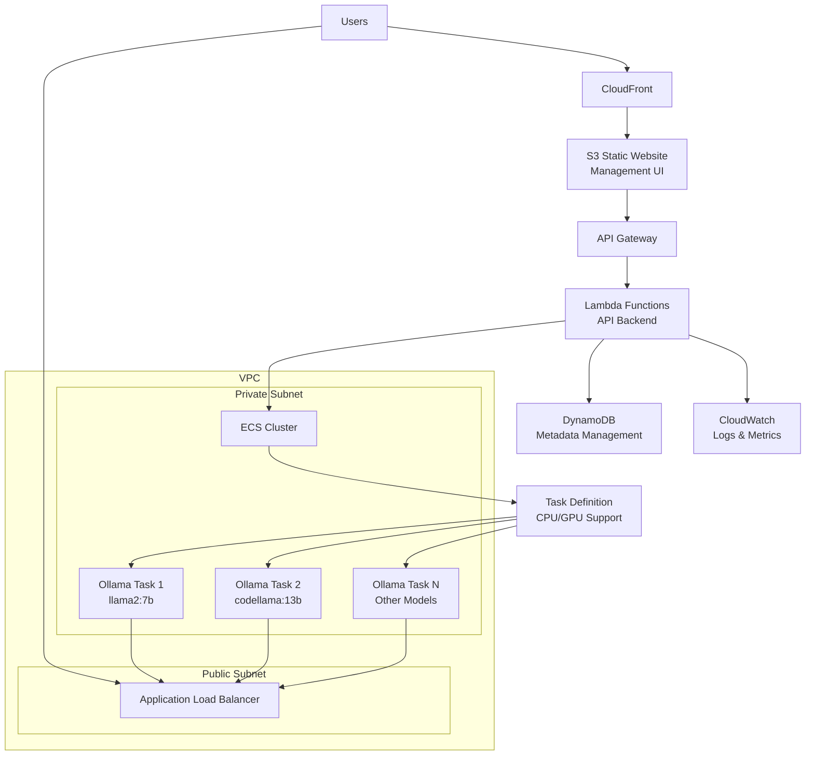
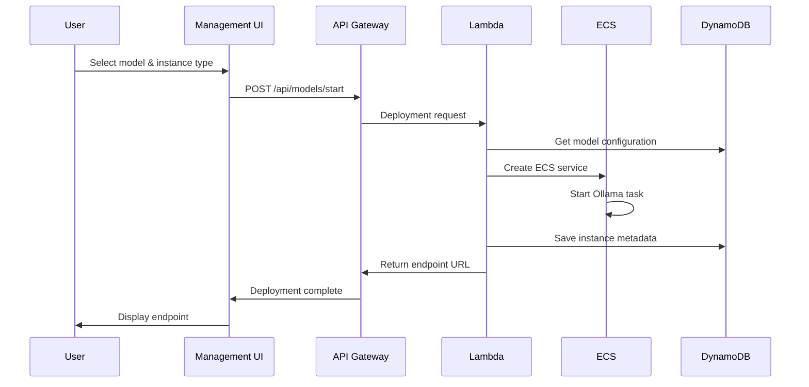

# AWS Ollama LLM Platform

🚀 **Dynamic Ollama LLM deployment on AWS with one-click CloudFormation setup**

[](https://opensource.org/licenses/Apache-2.0)
[](https://aws.amazon.com/)
[](https://ollama.com/)

## 🎯 Overview

This project provides a complete AWS-based solution for deploying and managing Ollama Large Language Models (LLMs) dynamically. Users can select any model and instance type through a web-based management interface, with automatic endpoint generation and monitoring.

**Key Features:**
- 🔄 Dynamic LLM deployment via ECS (Fargate/EC2)
- 🖥️ Web-based management dashboard (React.js)
- ⚡ Auto-scaling based on demand
- 💰 Cost optimization with automatic idle shutdown
- 🛡️ Secure VPC configuration
- 📊 Comprehensive monitoring and logging
- 🎯 One-click CloudFormation deployment

## 🏗️ Architecture



## 🚀 Quick Start

### Prerequisites
- AWS Account with appropriate permissions
- AWS CLI configured
- Domain name (optional, for custom endpoints)

### 1. Deploy Infrastructure

```bash
# Clone the repository
git clone https://github.com/clf13092/aws-ollama-llm-platform.git
cd aws-ollama-llm-platform

# Create parameters file
cat > parameters.json << EOF
[
  {
    "ParameterKey": "Environment",
    "ParameterValue": "production"
  },
  {
    "ParameterKey": "DomainName",
    "ParameterValue": "ollama.yourdomain.com"
  }
]
EOF

# Deploy the stack
aws cloudformation create-stack \
  --stack-name aws-ollama-platform \
  --template-body file://cloudformation/main.yaml \
  --parameters file://parameters.json \
  --capabilities CAPABILITY_IAM CAPABILITY_NAMED_IAM
```

### 2. Access Management Interface

After deployment completes (~15-20 minutes), access the management interface via the CloudFront URL provided in the stack outputs.

### 3. Deploy Your First Model

1. Open the management dashboard
2. Select a model (e.g., Llama2 7B, CodeLlama 13B)
3. Choose instance type (CPU/GPU)
4. Click "Deploy Model"
5. Get your API endpoint URL

## 📊 Component Details

### Frontend (Management UI)
- **Technology**: React.js + TypeScript + Material-UI
- **Hosting**: S3 Static Website + CloudFront
- **Features**:
  - Dashboard with running models overview
  - Model deployment interface
  - Endpoint management and testing
  - Real-time monitoring and logs

### Backend API
- **Technology**: AWS Lambda + Python (FastAPI)
- **Database**: DynamoDB
- **Endpoints**:
```
GET    /api/models              # List available models
POST   /api/models/start        # Deploy new model
DELETE /api/models/{id}/stop    # Stop running model
GET    /api/instances           # List running instances
GET    /api/instances/{id}      # Get instance details & endpoint
GET    /api/instances/{id}/logs # Retrieve logs
```

### Container Platform
- **ECS Cluster**: Mixed Fargate (CPU) + EC2 (GPU)
- **Auto Scaling**: Request-based scaling
- **Service Discovery**: AWS Cloud Map
- **Load Balancing**: Application Load Balancer

## 🔧 Supported Models

| Model | Size | CPU Support | GPU Support | Memory Required |
|-------|------|-------------|-------------|-----------------|
| Llama2 | 7B | ✅ | ✅ | 4GB |
| Llama2 | 13B | ✅ | ✅ | 8GB |
| CodeLlama | 7B | ✅ | ✅ | 4GB |
| CodeLlama | 13B | ✅ | ✅ | 8GB |
| Mistral | 7B | ✅ | ✅ | 4GB |

## 💡 Usage Examples

### API Usage
```bash
# List available models
curl https://api.ollama.yourdomain.com/api/models

# Deploy Llama2 model
curl -X POST https://api.ollama.yourdomain.com/api/models/start \
  -H "Content-Type: application/json" \
  -d '{
    "model_id": "llama2-7b",
    "instance_type": "ml.m5.large"
  }'

# Chat with deployed model
curl https://ollama-inst-001.yourdomain.com/api/generate \
  -H "Content-Type: application/json" \
  -d '{
    "model": "llama2",
    "prompt": "Hello, how are you?",
    "stream": false
  }'
```

### Model Workflow



## 🛡️ Security

- **VPC Isolation**: All compute resources in private subnets
- **IAM Policies**: Principle of least privilege
- **Security Groups**: Network-level access control
- **HTTPS Only**: All communication encrypted in transit
- **API Authentication**: Optional API key management

## 💰 Cost Optimization

- **Automatic Shutdown**: Idle instances stopped automatically
- **Spot Instances**: Optional for development workloads
- **Right-sizing**: CPU/GPU selection based on model requirements
- **Pay-per-use**: Only pay when models are running

## 📈 Monitoring

### CloudWatch Metrics
- ECS CPU/Memory utilization
- ALB response times
- API Gateway request counts
- Lambda execution duration and errors

### Logging
- ECS Task logs → CloudWatch Logs
- API Gateway access logs
- Lambda function logs
- Centralized log aggregation

## 🛠️ Development

### Project Structure
```
├── cloudformation/           # Infrastructure as Code
│   ├── main.yaml            # Master template
│   ├── network/             # VPC, subnets, gateways
│   ├── compute/             # ECS cluster, task definitions
│   ├── api/                 # Lambda functions, API Gateway
│   ├── storage/             # DynamoDB tables
│   ├── frontend/            # S3, CloudFront
│   └── security/            # IAM roles and policies
├── src/
│   ├── frontend/            # React management UI
│   ├── api/                 # Lambda function code
│   └── containers/          # Custom Ollama Docker images
├── docs/                    # Documentation
└── scripts/                 # Deployment and utility scripts
```

### Local Development
```bash
# Install dependencies
npm install

# Run frontend locally
cd src/frontend
npm start

# Deploy Lambda functions
cd src/api
sam deploy
```

## 🔮 Roadmap

- [ ] **Multi-region deployment**: Global distribution for low latency
- [ ] **Fine-tuning capabilities**: Custom model training
- [ ] **API key management**: Access control and billing integration
- [ ] **Webhook support**: External system integration
- [ ] **Model versioning**: A/B testing and rollback capabilities
- [ ] **Batch inference**: High-throughput processing

## 🤝 Contributing

We welcome contributions! Please see [CONTRIBUTING.md](CONTRIBUTING.md) for details.

1. Fork the repository
2. Create your feature branch (`git checkout -b feature/AmazingFeature`)
3. Commit your changes (`git commit -m 'Add some AmazingFeature'`)
4. Push to the branch (`git push origin feature/AmazingFeature`)
5. Open a Pull Request

## 📝 License

This project is licensed under the Apache 2.0 License - see the [LICENSE](LICENSE) file for details.

## 🆘 Support

- 📖 [Documentation](./docs/)
- 🐛 [Issue Tracker](https://github.com/clf13092/aws-ollama-llm-platform/issues)
- 💬 [Discussions](https://github.com/clf13092/aws-ollama-llm-platform/discussions)

## 🙏 Acknowledgments

- [Ollama](https://ollama.com/) for the amazing LLM runtime
- [AWS](https://aws.amazon.com/) for the cloud infrastructure
- The open-source community for inspiration and support

---

**⭐ If this project helps you, please consider giving it a star!**