# AWS Ollama LLM Platform

[🇯🇵 日本語版README](./README.ja.md) | [🇺🇸 English README](./README.md)

🚀 **Dynamic Ollama LLM deployment on AWS with secure authentication and one-click CloudFormation setup**

[](https://opensource.org/licenses/Apache-2.0)
[](https://aws.amazon.com/)
[](https://ollama.com/)
[](https://aws.amazon.com/cognito/)

## 🎯 Overview

This project provides a complete AWS-based solution for deploying and managing Ollama Large Language Models (LLMs) dynamically. Users can select any model and instance type through a secure web-based management interface with full authentication, automatic endpoint generation, and comprehensive monitoring.

**Key Features:**
- 🔒 **Secure Authentication**: AWS Cognito with user management
- 🔄 **Dynamic LLM deployment** via ECS (Fargate/EC2)
- 🖥️ **Web-based management dashboard** (React.js)
- ⚡ **Auto-scaling** based on demand
- 💰 **Cost optimization** with automatic idle shutdown
- 🛡️ **Secure VPC configuration** with private subnets
- 📊 **Comprehensive monitoring** and logging
- 🎯 **One-click CloudFormation deployment**

## 🏗️ Current Architecture

### **High-Level Architecture Diagram**

```mermaid
graph TB
    User[👤 Users] --> CF[☁️ CloudFront]
    User --> ALB[⚖️ Application Load Balancer]
    
    CF --> S3[📦 S3 Static Website<br/>React Management UI]
    
    S3 --> Cognito[🔐 AWS Cognito<br/>User Authentication]
    S3 --> APIGW[🌐 API Gateway<br/>Cognito Authorizer]
    
    Cognito --> APIGW
    APIGW --> Lambda[⚡ Lambda Functions<br/>API Backend]
    
    Lambda --> DDB[🗄️ DynamoDB<br/>Models & Instances]
    Lambda --> ECS[🐳 ECS Cluster<br/>Container Orchestration]
    Lambda --> ECR[📦 ECR<br/>Container Registry]
    
    ECS --> TaskDef[📋 Task Definitions<br/>CPU/GPU Support]
    TaskDef --> OllamaTask1[🤖 Ollama Container 1<br/>llama2:7b]
    TaskDef --> OllamaTask2[🤖 Ollama Container 2<br/>codellama:13b]
    TaskDef --> OllamaTaskN[🤖 Ollama Container N<br/>Other Models]
    
    OllamaTask1 --> ALB
    OllamaTask2 --> ALB
    OllamaTaskN --> ALB
    
    Lambda --> CW[📊 CloudWatch<br/>Logs & Metrics]
    
    subgraph VPC[🏢 VPC - Secure Network]
        subgraph PublicSubnet[🌐 Public Subnet]
            ALB
        end
        
        subgraph PrivateSubnet[🔒 Private Subnet]
            ECS
            OllamaTask1
            OllamaTask2
            OllamaTaskN
            Lambda
        end
    end
    
    subgraph AuthLayer[🔐 Authentication & Security Layer]
        Cognito
        UserPool[👥 User Pool<br/>User Management]
        IdentityPool[🆔 Identity Pool<br/>AWS Permissions]
        
        Cognito --> UserPool
        Cognito --> IdentityPool
    end
```



### **🔄 Complete Application Flow**

#### **1. User Authentication Flow**

```mermaid
sequenceDiagram
    participant U as 👤 User
    participant CF as ☁️ CloudFront
    participant S3 as 📦 S3 (React App)
    participant Cognito as 🔐 Cognito
    participant APIGW as 🌐 API Gateway
    
    U->>CF: 1. Access Application
    CF->>S3: 2. Serve React App
    S3->>U: 3. Login Page
    U->>S3: 4. Enter Credentials
    S3->>Cognito: 5. Authentication Request
    Cognito->>S3: 6. JWT Token
    S3->>U: 7. Dashboard Access
    
    Note over U,APIGW: User is now authenticated with JWT token
```


#### **2. Model Deployment Flow**

```mermaid
sequenceDiagram
    participant U as 👤 User
    participant UI as 🖥️ React UI
    participant APIGW as 🌐 API Gateway
    participant Lambda as ⚡ Lambda
    participant DDB as 🗄️ DynamoDB
    participant ECR as 📦 ECR
    participant ECS as 🐳 ECS
    participant Task as 🤖 Ollama Container
    
    U->>UI: 1. Select Model & Instance Type
    UI->>APIGW: 2. POST /instances (with JWT)
    APIGW->>Lambda: 3. Validate & Route Request
    Lambda->>DDB: 4. Get Model Configuration
    Lambda->>ECR: 5. Get Container Image URI
    Lambda->>ECS: 6. Start ECS Task
    ECS->>Task: 7. Deploy Ollama Container
    Task->>Task: 8. Download & Load Model
    Lambda->>DDB: 9. Save Instance Metadata
    Lambda->>UI: 10. Return Endpoint URL
    UI->>U: 11. Display Running Instance
    
    Note over Task: Container is now running and ready for inference
```


#### **3. Model Inference Flow**

```mermaid
sequenceDiagram
    participant U as 👤 User/App
    participant ALB as ⚖️ Load Balancer
    participant Task as 🤖 Ollama Container
    participant Model as 🧠 LLM Model
    
    U->>ALB: 1. POST /api/generate
    ALB->>Task: 2. Route to Container
    Task->>Model: 3. Process Prompt
    Model->>Task: 4. Generate Response
    Task->>ALB: 5. Return Response
    ALB->>U: 6. Deliver Result
    
    Note over Model: Model processes inference in memory
```


### **🏗️ Infrastructure Components**

#### **Frontend Layer**
- **CloudFront**: Global CDN for React application
- **S3**: Static website hosting with versioning
- **React App**: TypeScript-based management interface
- **Authentication**: AWS Amplify-free Cognito integration

#### **API Layer**
- **API Gateway**: RESTful API with Cognito authorization
- **Lambda Functions**: Serverless API backend
  - `instances-api`: Model deployment and management
  - `models-api`: Available model information
  - `auth-api`: User authentication helpers

#### **Container Layer**
- **ECR**: Private container registry for Ollama images
  - Base Ollama image
  - Model-specific pre-built images (llama2, codellama, mistral)
- **ECS**: Container orchestration
  - **Fargate**: For CPU-based models (ml.m5.*)
  - **EC2**: For GPU-based models (ml.g4dn.*, ml.p3.*)
- **Task Definitions**: Dynamic selection based on model requirements

#### **Data Layer**
- **DynamoDB**: NoSQL database for metadata
  - Models table: Available model configurations
  - Instances table: Running instance information
  - Users table: User preferences and quotas

#### **Network Layer**
- **VPC**: Isolated network environment
- **Private Subnets**: ECS tasks and Lambda functions
- **Public Subnets**: Application Load Balancer
- **Security Groups**: Fine-grained access control

### **🔧 Instance Type Management**

#### **Dynamic Task Definition Selection**
```python
def get_task_configuration(model_id, instance_type):
    # GPU instances require EC2 launch type
    if instance_type in ['ml.g4dn.xlarge', 'ml.g4dn.2xlarge', 'ml.p3.2xlarge']:
        return {
            'launch_type': 'EC2',
            'task_definition': GPU_TASK_DEFINITION_ARN,
            'placement_constraints': [
                {
                    'type': 'memberOf',
                    'expression': f'attribute:ecs.instance-type == {instance_type}'
                }
            ]
        }
    
    # CPU instances use Fargate
    else:
        return {
            'launch_type': 'FARGATE',
            'task_definition': CPU_TASK_DEFINITION_ARN
        }
```

#### **Model-Specific Container Images**
| Model | ECR Image | Instance Type | Launch Type |
|-------|-----------|---------------|-------------|
| Llama2 7B | `production-ollama-llama2-7b` | ml.m5.large | Fargate |
| Llama2 13B | `production-ollama-llama2-13b` | ml.m5.xlarge | Fargate |
| CodeLlama 7B | `production-ollama-codellama-7b` | ml.m5.large | Fargate |
| CodeLlama 13B | `production-ollama-codellama-13b` | ml.g4dn.xlarge | EC2 |
| Mistral 7B | `production-ollama-mistral-7b` | ml.m5.large | Fargate |

### **🔐 Security Architecture**

#### **Authentication & Authorization**
- **Cognito User Pool**: Centralized user management
- **JWT Tokens**: Stateless authentication
- **API Gateway Authorizer**: Automatic token validation
- **Role-based Access**: Admin vs User permissions

#### **Network Security**
- **VPC Isolation**: All resources in private network
- **Security Groups**: Least-privilege access
- **HTTPS Everywhere**: End-to-end encryption
- **Private Subnets**: No direct internet access for containers

#### **Data Security**
- **Encryption at Rest**: DynamoDB and S3
- **Encryption in Transit**: All API communications
- **User Isolation**: Each user can only access their own instances
- **Audit Logging**: All actions logged to CloudWatch

### **💰 Cost Optimization Features**

#### **Resource Management**
- **Automatic Shutdown**: Idle instances stopped after timeout
- **Right-sizing**: Appropriate instance types per model
- **Spot Instances**: Optional for development workloads
- **Pay-per-use**: Only pay when models are running

#### **Container Optimization**
- **Pre-built Images**: Faster startup times
- **Model Caching**: Reduced download times
- **Resource Limits**: Prevent resource waste
- **Health Checks**: Automatic failure recovery

### **📊 Monitoring & Observability**

#### **Metrics & Logging**
- **CloudWatch Metrics**: ECS, Lambda, API Gateway
- **Application Logs**: Centralized logging
- **Performance Monitoring**: Response times and error rates
- **Cost Tracking**: Real-time cost monitoring

#### **Alerting**
- **Health Checks**: Container and service health
- **Error Alerts**: Failed deployments and API errors
- **Cost Alerts**: Budget threshold notifications
- **Security Alerts**: Authentication failures

## 🚀 Quick Start

### Prerequisites
- AWS Account with appropriate permissions
- AWS CLI configured
- Docker installed and running
- Domain name (optional, for custom endpoints)
- Email address for admin account

### 1. Deploy Infrastructure

```bash
# Clone the repository
git clone https://github.com/clf13092/aws-ollama-llm-platform.git
cd aws-ollama-llm-platform

# Create parameters file
cat > parameters.json << EOF
[
  {
    "ParameterKey": "Environment",
    "ParameterValue": "production"
  },
  {
    "ParameterKey": "DomainName",
    "ParameterValue": "ollama.yourdomain.com"
  },
  {
    "ParameterKey": "AdminEmail",
    "ParameterValue": "admin@yourdomain.com"
  },
  {
    "ParameterKey": "EnableMFA",
    "ParameterValue": "false"
  }
]
EOF

# Deploy the complete stack (ECR + Docker images + Infrastructure)
sh scripts/deploy.sh
```

### 2. Access Management Interface

After deployment completes (~20-30 minutes):

1. **Get the CloudFront URL** from the deployment output
2. **Open the management interface** in your browser
3. **Create admin user**:
   ```bash
   aws cognito-idp admin-create-user \
     --user-pool-id <USER_POOL_ID> \
     --username admin \
     --user-attributes Name=email,Value=admin@yourdomain.com \
     --temporary-password TempPass123! \
     --message-action SUPPRESS
   ```
4. **Login with admin credentials**:
   - Username: `admin`
   - Temporary Password: `TempPass123!`
5. **Set permanent password** when prompted
6. **Access the dashboard** to manage your LLM models

### 3. Deploy Your First Model

1. **Login to the dashboard**
2. **Navigate to "Models"** section
3. **Select a model** (e.g., Llama2 7B, CodeLlama 13B)
4. **Choose instance type** (CPU/GPU based on requirements)
5. **Click "Deploy Model"**
6. **Get your API endpoint URL** from the instances list

### 4. Test Model Inference

```bash
# Example API call to deployed model
curl -X POST https://your-alb-endpoint.amazonaws.com/api/generate \
  -H "Content-Type: application/json" \
  -d '{
    "model": "llama2:7b",
    "prompt": "Explain quantum computing in simple terms",
    "stream": false
  }'
```

## 🔧 Development Workflow

### **Lambda Function Development**

```bash
# 1. Modify Lambda functions in lambda-functions/ directory
# 2. Package and deploy Lambda functions
sh scripts/package-lambda.sh

# 3. Update CloudFormation stack
sh scripts/deploy.sh
```

### **Docker Image Updates**

```bash
# 1. Modify Dockerfiles in docker/ directory
# 2. Build and push new images
sh scripts/build-and-push-images.sh

# 3. Update ECS tasks (automatic with new deployment)
```

### **Frontend Development**

```bash
# 1. Develop locally
cd src/test/my-app
npm run dev

# 2. Deploy changes
sh scripts/deploy.sh
```

## 🔒 Authentication & Security

### AWS Cognito Configuration
- **User Pool**: Centralized user management with email verification
- **Password Policy**: 8+ characters, mixed case, numbers, symbols
- **Account Security**: Automatic lockout after 5 failed attempts
- **MFA Support**: Optional SMS/TOTP authentication
- **Session Management**: JWT tokens with configurable expiration

### Access Control
- **Role-based permissions**:
  - **Admin**: Full system access and user management
  - **User**: Personal model management only
  - **ReadOnly**: View-only access to models and logs
- **API Protection**: All management APIs require valid JWT tokens
- **Resource Isolation**: Users can only access their own deployed models

### Security Features
- **HTTPS Everywhere**: All communication encrypted in transit
- **VPC Isolation**: Compute resources in private subnets
- **Network Security**: Security groups with least-privilege access
- **IAM Policies**: Principle of least privilege for all AWS resources

## 📊 Component Details

### Frontend (Management UI)
- **Technology**: React.js + TypeScript + Material-UI + AWS Amplify Auth
- **Hosting**: S3 Static Website + CloudFront CDN
- **Features**:
  - **Secure Login/Signup** with email verification
  - **Dashboard** with running models overview (authenticated users only)
  - **Model deployment interface** with real-time status
  - **Endpoint management** and testing capabilities
  - **Real-time monitoring** and log viewing
  - **User profile management** with password change and MFA setup

### Backend API
- **Technology**: AWS Lambda + Python (FastAPI) + boto3
- **Authentication**: API Gateway Cognito Authorizer + JWT validation
- **Database**: DynamoDB with user-scoped data access
- **Endpoints**:

```bash
# Public endpoints (no authentication required)
POST   /api/auth/login          # User login
POST   /api/auth/signup         # User registration
POST   /api/auth/reset-password # Password reset

# Protected endpoints (JWT token required)
GET    /api/models              # List available models
POST   /api/models/start        # Deploy new model (user-scoped)
DELETE /api/models/{id}/stop    # Stop running model (owner only)
GET    /api/instances           # List user's running instances
GET    /api/instances/{id}      # Get instance details & endpoint
GET    /api/instances/{id}/logs # Retrieve instance logs
GET    /api/user/profile        # Get user profile
PUT    /api/user/profile        # Update user profile
GET    /api/health              # System health check
```

### Container Platform
- **ECS Cluster**: Mixed Fargate (CPU) + EC2 (GPU) deployment
- **Auto Scaling**: Request-based scaling with cost optimization
- **Service Discovery**: AWS Cloud Map for internal service communication
- **Load Balancing**: Application Load Balancer with health checks
- **User Isolation**: Each user's models deployed in separate namespaces

## 🔧 Supported Models

| Model | Size | CPU Support | GPU Support | Memory Required | Deployment Time |
|-------|------|-------------|-------------|-----------------|-----------------|
| Llama2 | 7B | ✅ | ✅ | 4GB | ~3 minutes |
| Llama2 | 13B | ✅ | ✅ | 8GB | ~5 minutes |
| CodeLlama | 7B | ✅ | ✅ | 4GB | ~3 minutes |
| CodeLlama | 13B | ✅ | ✅ | 8GB | ~5 minutes |
| Mistral | 7B | ✅ | ✅ | 4GB | ~3 minutes |
| Mistral | 7B Instruct | ✅ | ✅ | 4GB | ~3 minutes |

## 💡 Usage Examples

### Authentication Flow
```bash
# 1. User registration
curl -X POST https://api.ollama.yourdomain.com/api/auth/signup \
  -H "Content-Type: application/json" \
  -d '{
    "email": "user@example.com",
    "password": "SecurePass123!",
    "confirmPassword": "SecurePass123!"
  }'

# 2. Login and get JWT token
response=$(curl -X POST https://api.ollama.yourdomain.com/api/auth/login \
  -H "Content-Type: application/json" \
  -d '{
    "email": "user@example.com",
    "password": "SecurePass123!"
  }')

# Extract JWT token
jwt_token=$(echo $response | jq -r '.access_token')
```

### Authenticated API Usage
```bash
# List available models (requires authentication)
curl https://api.ollama.yourdomain.com/api/models \
  -H "Authorization: Bearer $jwt_token"

# Deploy Llama2 model
curl -X POST https://api.ollama.yourdomain.com/api/models/start \
  -H "Authorization: Bearer $jwt_token" \
  -H "Content-Type: application/json" \
  -d '{
    "model_id": "llama2-7b",
    "instance_type": "ml.m5.large"
  }'

# List your running instances
curl https://api.ollama.yourdomain.com/api/instances \
  -H "Authorization: Bearer $jwt_token"

# Chat with your deployed model
curl https://ollama-inst-001.yourdomain.com/api/generate \
  -H "Content-Type: application/json" \
  -d '{
    "model": "llama2",
    "prompt": "Hello, how are you?",
    "stream": false
  }'
```

### Authenticated Model Workflow


## 🛡️ Security Best Practices

### Infrastructure Security
- **VPC Isolation**: All compute resources in private subnets
- **Security Groups**: Network-level access control with minimal required ports
- **IAM Policies**: Principle of least privilege for all AWS resources
- **Encryption**: All data encrypted in transit and at rest

### Application Security
- **JWT Tokens**: Secure authentication with configurable expiration
- **Input Validation**: All API inputs validated and sanitized
- **Rate Limiting**: API endpoints protected against abuse
- **Audit Logging**: All user actions logged for security monitoring

### Operational Security
- **Automated Updates**: Regular security patches for container images
- **Monitoring**: Real-time security event monitoring
- **Backup**: Automated backups of user data and configurations
- **Incident Response**: Automated alerting for security events

## 💰 Cost Optimization

- **Automatic Shutdown**: Idle instances stopped after configurable timeout
- **Spot Instances**: Optional for development workloads (up to 90% savings)
- **Right-sizing**: Automatic CPU/GPU selection based on model requirements
- **Pay-per-use**: Only pay when models are actively running
- **Resource Monitoring**: Real-time cost tracking and alerts

## 📈 Monitoring & Observability

### CloudWatch Metrics
- **System Metrics**: ECS CPU/Memory utilization, ALB response times
- **Application Metrics**: API Gateway request counts, Lambda execution duration
- **Business Metrics**: Active users, model deployment success rates
- **Cost Metrics**: Real-time cost tracking per user and model

### Logging & Alerting
- **Centralized Logging**: All logs aggregated in CloudWatch Logs
- **Security Monitoring**: Authentication failures, unusual access patterns
- **Performance Alerts**: High latency, error rates, resource exhaustion
- **Cost Alerts**: Spending thresholds and budget notifications

## 🛠️ Development & Deployment

### Project Structure
```
├── cloudformation/           # Infrastructure as Code
│   ├── main.yaml            # Master template
│   ├── network/             # VPC, subnets, gateways
│   ├── compute/             # ECS cluster, task definitions
│   ├── api/                 # Lambda functions, API Gateway
│   ├── auth/                # Cognito User Pool & Identity Pool
│   ├── storage/             # DynamoDB tables
│   ├── frontend/            # S3, CloudFront
│   └── security/            # IAM roles and policies
├── src/
│   ├── frontend/            # React management UI with auth
│   ├── api/                 # Lambda function code
│   └── containers/          # Custom Ollama Docker images
├── docs/                    # Documentation
└── scripts/                 # Deployment and utility scripts
```

### Local Development
```bash
# Install dependencies
npm install

# Configure AWS credentials for Cognito
export AWS_REGION=us-east-1
export COGNITO_USER_POOL_ID=<your-user-pool-id>
export COGNITO_CLIENT_ID=<your-client-id>

# Run frontend locally with authentication
cd src/frontend
npm start

# Deploy Lambda functions
cd src/api
sam deploy
```

## 🔮 Roadmap

### Security Enhancements
- [ ] **SSO Integration**: SAML/OIDC support for enterprise authentication
- [ ] **API Key Management**: Long-term API keys for automated access
- [ ] **Audit Dashboard**: Comprehensive security and access monitoring

### Platform Features
- [ ] **Multi-region deployment**: Global distribution for low latency
- [ ] **Fine-tuning capabilities**: Custom model training and deployment
- [ ] **Model versioning**: A/B testing and rollback capabilities
- [ ] **Batch inference**: High-throughput batch processing
- [ ] **Team Management**: Organization and team-based access control

### Integrations
- [ ] **Webhook support**: External system integration and notifications
- [ ] **Slack/Teams bots**: ChatOps integration for model management
- [ ] **CI/CD integration**: Automated model deployment pipelines

## 🤝 Contributing

We welcome contributions! Please see [CONTRIBUTING.md](CONTRIBUTING.md) for details.

### Security Disclosure
If you discover a security vulnerability, please email security@yourdomain.com instead of opening a public issue.

1. Fork the repository
2. Create your feature branch (`git checkout -b feature/AmazingFeature`)
3. Commit your changes (`git commit -m 'Add some AmazingFeature'`)
4. Push to the branch (`git push origin feature/AmazingFeature`)
5. Open a Pull Request

## 📝 License

This project is licensed under the Apache 2.0 License - see the [LICENSE](LICENSE) file for details.

## 🆘 Support

- 📖 [Documentation](./docs/)
- 🐛 [Issue Tracker](https://github.com/clf13092/aws-ollama-llm-platform/issues)
- 💬 [Discussions](https://github.com/clf13092/aws-ollama-llm-platform/discussions)
- 🔒 [Security Issues](mailto:security@yourdomain.com)

## 🙏 Acknowledgments

- [Ollama](https://ollama.com/) for the amazing LLM runtime
- [AWS](https://aws.amazon.com/) for the comprehensive cloud infrastructure
- [AWS Cognito](https://aws.amazon.com/cognito/) for secure user authentication
- The open-source community for inspiration and support

---

**⭐ If this project helps you, please consider giving it a star!**

**🔒 Security Notice**: This platform includes production-ready authentication and authorization. Please review the security configuration before deploying to production environments.