# AWS Ollama LLM Platform

[🇯🇵 日本語版README](./README.ja.md) | [🇺🇸 English README](./README.md)

🚀 **Dynamic Ollama LLM deployment on AWS with secure authentication and one-click CloudFormation setup**

[](https://opensource.org/licenses/Apache-2.0)
[](https://aws.amazon.com/)
[](https://ollama.com/)
[](https://aws.amazon.com/cognito/)

## 🎯 Overview

This project provides a complete AWS-based solution for deploying and managing Ollama Large Language Models (LLMs) dynamically. Users can select any model and compute resources through a secure web-based management interface with full authentication, automatic endpoint generation, and comprehensive monitoring.

**Key Features:**
- ✨ **Flexible Compute Selection**: Dynamically choose between **Fargate (CPU)** or **EC2 (GPU)** when deploying models.
- ⚙️ **Dynamic Resource Specification**: Select specific vCPU/memory combinations for Fargate or instance types for GPU from a dropdown menu to match model requirements.
- 🔒 **Secure Authentication**: AWS Cognito with user management
- 🔄 **Dynamic LLM deployment** via ECS (Fargate/EC2)
- 🖥️ **Web-based management dashboard** (React.js)
- ⚡ **Auto-scaling** based on demand
- 💰 **Cost optimization** with automatic idle shutdown
- 🛡️ **Secure VPC configuration** with private subnets
- 📊 **Comprehensive monitoring** and logging
- 🎯 **One-click CloudFormation deployment**

## 🏗️ Architecture

```mermaid
graph TB
    User[👤 Users] --> CF[☁️ CloudFront]
    User --> ALB[⚖️ Application Load Balancer]
    
    CF --> S3[📦 S3 Static Website<br/>React Management UI]
    
    S3 --> Cognito[🔐 AWS Cognito<br/>User Authentication]
    S3 --> APIGW[🌐 API Gateway<br/>Cognito Authorizer]
    
    Cognito --> APIGW
    APIGW --> Lambda[⚡ Lambda Functions<br/>API Backend]
    
    Lambda --> DDB[🗄️ DynamoDB<br/>Models & Instances]
    Lambda --> ECS[🐳 ECS Cluster<br/>Container Orchestration]
    
    ECS --> TaskDef[📋 Task Definitions<br/>CPU/GPU Support]
    TaskDef --> OllamaTask1[🤖 Ollama Container 1<br/>llama2:7b]
    TaskDef --> OllamaTask2[🤖 Ollama Container 2<br/>codellama:13b]
    TaskDef --> OllamaTaskN[🤖 Ollama Container N<br/>Other Models]
    
    OllamaTask1 --> ALB
    OllamaTask2 --> ALB
    OllamaTaskN --> ALB
    
    Lambda --> CW[📊 CloudWatch<br/>Logs & Metrics]
    
    subgraph VPC[🏢 VPC - Secure Network]
        subgraph PublicSubnet[🌐 Public Subnet]
            ALB
        end
        
        subgraph PrivateSubnet[🔒 Private Subnet]
            ECS
            OllamaTask1
            OllamaTask2
            OllamaTaskN
        end
    end
    
    subgraph AuthLayer[🔐 Authentication & Security Layer]
        Cognito
        UserPool[👥 User Pool<br/>User Management]
        IdentityPool[🆔 Identity Pool<br/>AWS Permissions]
        
        Cognito --> UserPool
        Cognito --> IdentityPool
    end
```



The API Handler Lambda dynamically switches the ECS task's launch type or capacity provider based on the compute type (Fargate or GPU) specified by the user from the UI. For Fargate, it creates a task definition with the specified vCPU and memory. For GPU, it allocates the specified number of GPU resources on an EC2 instance to the container. This architecture allows for the efficient execution of diverse models while balancing cost and performance.

## 🚀 Quick Start

This project includes a comprehensive deployment script that automates the entire setup process, from building Docker images to deploying AWS infrastructure and frontend assets.

### Prerequisites

-   **AWS Account**: An AWS account with permissions to create the resources listed below. For initial deployment, administrator-level permissions (such as the `AdministratorAccess` managed policy) are recommended to ensure the script can create all necessary resources, including IAM roles.
-   **AWS CLI**: The AWS Command Line Interface must be installed and configured with your credentials. Run `aws configure` if you haven't already.
-   **Docker**: Docker must be installed and running on your local machine to build and push the container images.
-   **Node.js & npm**: Required to build the frontend application.

### Deployment Steps

1.  **Clone the Repository**
    ```bash
    git clone https://github.com/clf13092/aws-ollama-llm-platform.git
    cd aws-ollama-llm-platform
    ```

2.  **Configure Parameters**
    The deployment script uses a `parameters.json` file for configuration. A template is provided as `parameters-template.json`.
    ```bash
    # Create your parameters file from the template
    cp parameters-template.json parameters.json
    ```
    Now, **edit `parameters.json`** to set your desired configuration, such as `DomainName` and `AdminEmail`.

3.  **Run the Deployment Script**
    Execute the main deployment script. It will handle everything.
    ```bash
    sh scripts/deploy.sh
    ```
    The script will:
    - Package and deploy all CloudFormation stacks.
    - Build the Ollama Docker container and push it to a new ECR repository.
    - Build the React frontend.
    - Upload the frontend assets to S3.
    - Provide you with the application URL upon completion.

### Required IAM Permissions

The deployment script provisions a significant number of AWS resources. The IAM principal (user or role) running the script requires permissions for the following services:

-   AWS CloudFormation
-   Amazon S3
-   Amazon IAM
-   Amazon ECR (Elastic Container Registry)
-   Amazon ECS (Elastic Container Service)
-   Amazon EC2 (for VPC, Security Groups, etc.)
-   Amazon DynamoDB
-   Amazon Cognito
-   Amazon API Gateway
-   AWS Lambda
-   Amazon CloudFront
-   Amazon Route 53 (if DNS setup is enabled)
-   AWS STS

Due to the extensive permissions required, especially for creating IAM roles, it is recommended to use an IAM user or role with the `AdministratorAccess` managed policy for the initial setup.

## 💡 Usage Examples

### Authentication Flow
```bash
# 1. User registration
curl -X POST https://api.ollama.yourdomain.com/api/auth/signup \
  -H "Content-Type: application/json" \
  -d '{
    "email": "user@example.com",
    "password": "SecurePass123!",
    "confirmPassword": "SecurePass123!"
  }'

# 2. Login and get JWT token
response=$(curl -X POST https://api.ollama.yourdomain.com/api/auth/login \
  -H "Content-Type: application/json" \
  -d '{
    "email": "user@example.com",
    "password": "SecurePass123!"
  }')

# Extract JWT token
jwt_token=$(echo $response | jq -r '.access_token')
```

### Authenticated API Usage
```bash
# List available models (requires authentication)
curl https://api.ollama.yourdomain.com/api/models \
  -H "Authorization: Bearer $jwt_token"

# Deploy Llama2 model on Fargate
curl -X POST https://api.ollama.yourdomain.com/api/models/deploy \
  -H "Authorization: Bearer $jwt_token" \
  -H "Content-Type: application/json" \
  -d '{
    "model_name": "llama2:7b",
    "fargate_resources": {"cpu": 2048, "memory": 8192}
  }'

# Deploy a model on GPU
curl -X POST https://api.ollama.yourdomain.com/api/models/deploy \
  -H "Authorization: Bearer $jwt_token" \
  -H "Content-Type: application/json" \
  -d '{
    "model_name": "codellama:13b",
    "instance_type": "g5.xlarge"
  }'

# List your running instances
curl https://api.ollama.yourdomain.com/api/instances \
  -H "Authorization: Bearer $jwt_token"

# Chat with your deployed model
curl https://<your-instance-endpoint>/api/generate \
  -H "Content-Type: application/json" \
  -d '{
    "model": "llama2:7b",
    "prompt": "Explain quantum computing in simple terms",
    "stream": false
  }'
```

## 🛡️ Security

- **VPC Isolation**: All compute resources in private subnets.
- **IAM Policies**: Principle of least privilege for all AWS resources.
- **Network Security**: Security groups with minimal required ports.
- **Authentication**: All management APIs are protected via AWS Cognito JWT authorizer.
- **Data Encryption**: Data is encrypted in transit (TLS) and at rest (AWS KMS).

## 💰 Cost Optimization

- **Automatic Shutdown**: Idle instances are stopped after a configurable timeout (future feature).
- **Right-sizing**: Users can select the appropriate CPU/GPU/Memory resources for each model.
- **Pay-per-use**: You only pay for the resources while the model is deployed.

## 🛠️ Development & Deployment

### Project Structure
```
├── cloudformation/           # Infrastructure as Code
│   ├── main.yaml            # Master template
│   ├── network/             # VPC, subnets, gateways
│   ├── compute/             # ECS cluster, task definitions
│   ├── api/                 # Lambda functions, API Gateway
│   ├── auth/                # Cognito User Pool & Identity Pool
│   ├── storage/             # DynamoDB tables
│   ├── frontend/            # S3, CloudFront
│   └── security/            # IAM roles and policies
├── docker/                  # Custom Ollama Docker image
│   └── base/
├── frontend/                # React management UI source code
└── scripts/                 # Deployment and utility scripts
```

## 🔮 Roadmap

- [ ] **Fine-tuning Capabilities**: UI for training and deploying custom models.
- [ ] **Model Versioning**: A/B testing and rollback features.
- [ ] **Cost Monitoring**: Real-time cost tracking and alerts per user/model.
- [ ] **SSO Integration**: SAML/OIDC support for enterprise authentication.

## 🤝 Contributing

Contributions are welcome! Please see [CONTRIBUTING.md](CONTRIBUTING.md) for details.

## 📝 License

This project is licensed under the Apache 2.0 License - see the [LICENSE](LICENSE) file for details.