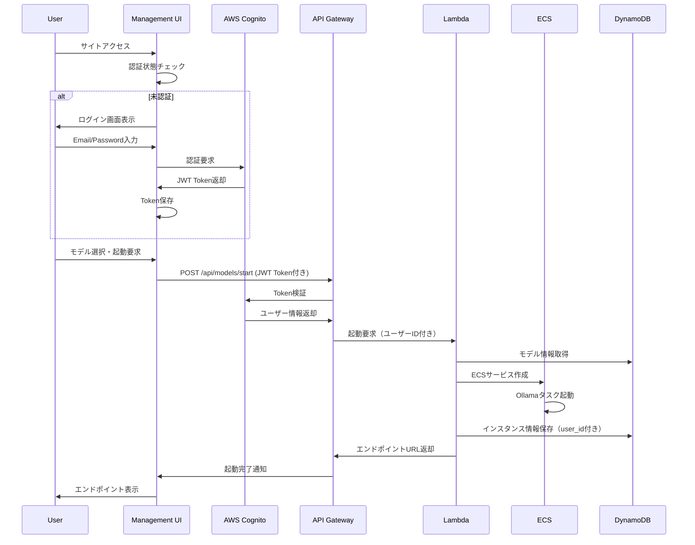

# AWS Ollama LLM システム設計書

## 概要

本システムは、AWS上でOllamaを利用したLLM（Large Language Model）を動的に起動・管理するためのクラウドネイティブソリューションです。ユーザーはWebベースの管理画面から簡単にモデルを選択し、適切なインスタンスタイプで起動できます。

## システム構成図

```mermaid
graph TB
    User[ユーザー] --> CF[CloudFront]
    User --> ALB[Application Load Balancer]
    
    CF --> S3[S3 Static Website<br/>管理UI]
    
    S3 --> Cognito[AWS Cognito<br/>認証・認可]
    S3 --> APIGW[API Gateway<br/>Cognito Authorizer]
    
    Cognito --> APIGW
    APIGW --> Lambda[Lambda Functions<br/>API Backend]
    
    Lambda --> DDB[DynamoDB<br/>メタデータ管理]
    Lambda --> ECS[ECS Cluster]
    
    ECS --> TaskDef[Task Definition<br/>CPU/GPU対応]
    TaskDef --> OllamaTask1[Ollama Task 1<br/>llama2:7b]
    TaskDef --> OllamaTask2[Ollama Task 2<br/>codellama:13b]
    TaskDef --> OllamaTaskN[Ollama Task N<br/>その他モデル]
    
    OllamaTask1 --> ALB
    OllamaTask2 --> ALB
    OllamaTaskN --> ALB
    
    Lambda --> CW[CloudWatch<br/>ログ・メトリクス]
    
    subgraph VPC[VPC]
        subgraph PublicSubnet[パブリックサブネット]
            ALB
        end
        
        subgraph PrivateSubnet[プライベートサブネット]
            ECS
            OllamaTask1
            OllamaTask2
            OllamaTaskN
        end
    end
    
    subgraph 認証・セキュリティ層[認証・セキュリティ層]
        Cognito
        UserPool[User Pool<br/>ユーザー管理]
        IdentityPool[Identity Pool<br/>AWS権限]
        
        Cognito --> UserPool
        Cognito --> IdentityPool
    end
    
    CloudFormation[CloudFormation<br/>テンプレート] -.-> VPC
    CloudFormation -.-> S3
    CloudFormation -.-> APIGW
    CloudFormation -.-> Lambda
    CloudFormation -.-> DDB
    CloudFormation -.-> ECS
    CloudFormation -.-> ALB
    CloudFormation -.-> CF
    CloudFormation -.-> Cognito
```

## アーキテクチャ詳細

### 1. フロントエンド層

#### 管理UI (React.js)
- **ホスティング**: S3 Static Website + CloudFront
- **技術スタック**: React.js + TypeScript + Material-UI + AWS Amplify Auth
- **主要機能**:
  - **認証画面**: ログイン・サインアップ・パスワードリセット
  - **ダッシュボード**: 稼働中モデル一覧（認証後のみアクセス可能）
  - **モデル起動画面**: モデル・インスタンス選択
  - **エンドポイント管理**: API URL表示、テスト機能
  - **監視・ログ表示**: リアルタイム監視
  - **プロフィール管理**: パスワード変更、MFA設定

#### 認証フロー
```
未認証ユーザー → ログイン画面 → Cognito認証 → JWT Token取得 → ダッシュボード
↓
Protected Routes（認証が必要なページ）へのアクセス制御
```

### 2. API層

#### Backend API (Lambda)
- **実行環境**: AWS Lambda + Python
- **フレームワーク**: FastAPI + boto3
- **認証**: API Gateway Cognito Authorizer + JWT Token検証
- **エンドポイント設計**:

```
# 認証不要
POST   /api/auth/login          # ログイン（Cognito経由）
POST   /api/auth/signup         # サインアップ
POST   /api/auth/reset-password # パスワードリセット

# 認証必要（JWT Token必須）
GET    /api/models              # 利用可能モデル一覧取得
POST   /api/models/start        # モデル起動（ECSサービス作成）
DELETE /api/models/{id}/stop    # モデル停止（ECSサービス削除）
GET    /api/instances           # 稼働中インスタンス一覧
GET    /api/instances/{id}      # インスタンス詳細・エンドポイント
GET    /api/instances/{id}/logs # ログ取得
GET    /api/user/profile        # ユーザープロフィール
PUT    /api/user/profile        # プロフィール更新
GET    /api/health              # ヘルスチェック
```

#### 認証・認可設計
- **API Gateway**: Cognito User Pool Authorizer
- **Lambda Authorizer**: カスタム権限チェック
- **権限レベル**:
  - **Admin**: 全操作可能
  - **User**: 自身のモデルのみ操作可能
  - **ReadOnly**: 閲覧のみ

### 3. コンピューティング層

#### ECS Cluster設計
- **インフラ**: Fargate（CPU）+ EC2（GPU）
- **自動スケーリング**: リクエスト数ベース
- **サービスディスカバリー**: AWS Cloud Map

#### Ollama Task Definition
```json
{
  "family": "ollama-{model-name}",
  "cpu": "1024-4096",
  "memory": "2048-16384",
  "requiresAttributes": [
    {
      "name": "com.amazonaws.ecs.capability.gpu"
    }
  ],
  "containerDefinitions": [
    {
      "name": "ollama",
      "image": "custom/ollama:{model-tag}",
      "portMappings": [
        {
          "containerPort": 11434,
          "protocol": "tcp"
        }
      ],
      "healthCheck": {
        "command": ["CMD-SHELL", "curl -f http://localhost:11434/api/tags || exit 1"]
      }
    }
  ]
}
```

### 4. データ層

#### DynamoDB テーブル設計

**models テーブル**
```
model_id (PK)    | model_name     | image_uri              | cpu_req | memory_req | gpu_req
llama2-7b        | Llama2 7B      | custom/ollama:llama2   | 2048    | 4096       | false
codellama-13b    | CodeLlama 13B  | custom/ollama:codellama| 4096    | 8192       | true
```

**instances テーブル**
```
instance_id (PK) | model_id | user_id    | ecs_service_arn | endpoint_url              | status  | created_at
inst-001         | llama2-7b| user-123   | arn:aws:ecs:... | https://api.example.com/1 | running | 2024-01-01T00:00:00Z
```

**users テーブル**
```
user_id (PK)     | cognito_sub    | email              | role    | created_at           | last_login
user-123         | uuid-xxx-yyy   | user@example.com   | User    | 2024-01-01T00:00:00Z | 2024-01-01T00:00:00Z
```

### 5. ネットワーク・セキュリティ層

#### VPC設計
- **パブリックサブネット**: ALB、NAT Gateway
- **プライベートサブネット**: ECS Tasks、Lambda（VPC内）

#### セキュリティグループ
```
ALB-SG:
  - Inbound: 443 (HTTPS) from 0.0.0.0/0
  - Outbound: 11434 to ECS-SG

ECS-SG:
  - Inbound: 11434 from ALB-SG
  - Outbound: 443 to 0.0.0.0/0 (モデルダウンロード用)
```

#### AWS Cognito設定
```
User Pool設定:
  - パスワードポリシー: 8文字以上、大小英数字+記号
  - MFA: SMS/TOTP（オプション）
  - アカウントロックアウト: 5回失敗で30分ロック
  - Email検証: 必須

App Client設定:
  - OAuth Flows: Authorization Code Grant
  - OAuth Scopes: openid, email, profile
  - Callback URLs: https://ollama.yourdomain.com/auth/callback
  - Logout URLs: https://ollama.yourdomain.com/auth/logout

Identity Pool設定:
  - 認証済みユーザー: 限定的AWS権限
  - 未認証ユーザー: アクセス拒否
```

## 運用設計

### 1. 監視・ログ

#### CloudWatch メトリクス
- ECS CPU/Memory使用率
- ALBレスポンス時間
- API Gateway リクエスト数
- Lambda実行時間・エラー率

#### ログ集約
- ECS Task ログ → CloudWatch Logs
- API Gateway アクセスログ
- Lambda実行ログ

### 2. コスト最適化

#### 自動停止機能
- アイドル時間ベースの自動停止（Lambda + EventBridge）
- スケジュールベースの停止（夜間・週末）

#### リソース効率化
- Spot Instances利用（開発環境）
- Reserved Instancesの活用

### 3. セキュリティ

#### IAM設計
```json
{
  "Version": "2012-10-17",
  "Statement": [
    {
      "Effect": "Allow",
      "Action": [
        "ecs:CreateService",
        "ecs:DeleteService",
        "ecs:DescribeServices",
        "ecs:UpdateService"
      ],
      "Resource": "arn:aws:ecs:*:*:service/ollama-*"
    }
  ]
}
```

## デプロイメント

### CloudFormation テンプレート構造

```
cloudformation/
├── main.yaml                 # マスターテンプレート
├── network/
│   └── vpc.yaml             # VPC、サブネット、ゲートウェイ
├── compute/
│   ├── ecs-cluster.yaml     # ECSクラスタ
│   └── task-definitions.yaml # タスク定義テンプレート
├── api/
│   ├── lambda.yaml          # Lambda関数
│   └── api-gateway.yaml     # API Gateway + Cognito Authorizer
├── storage/
│   └── dynamodb.yaml        # DynamoDB テーブル
├── frontend/
│   ├── s3.yaml             # S3バケット
│   └── cloudfront.yaml     # CloudFront ディストリビューション
├── auth/
│   ├── cognito.yaml        # Cognito User Pool + Identity Pool
│   └── cognito-domain.yaml # カスタムドメイン設定
└── security/
    └── iam.yaml            # IAM ロール・ポリシー
```

### デプロイコマンド

```bash
# パラメータファイル作成
cat > parameters.json << EOF
[
  {
    "ParameterKey": "Environment",
    "ParameterValue": "production"
  },
  {
    "ParameterKey": "DomainName",
    "ParameterValue": "ollama.yourdomain.com"
  },
  {
    "ParameterKey": "AdminEmail",
    "ParameterValue": "admin@yourdomain.com"
  },
  {
    "ParameterKey": "EnableMFA",
    "ParameterValue": "false"
  }
]
EOF

# スタック作成
aws cloudformation create-stack \
  --stack-name aws-ollama-system \
  --template-body file://cloudformation/main.yaml \
  --parameters file://parameters.json \
  --capabilities CAPABILITY_IAM CAPABILITY_NAMED_IAM

# デプロイ完了後、初期管理者ユーザー作成
aws cognito-idp admin-create-user \
  --user-pool-id <USER_POOL_ID> \
  --username admin \
  --user-attributes Name=email,Value=admin@yourdomain.com \
  --temporary-password TempPass123! \
  --message-action SUPPRESS
```

## 利用フロー

### 1. 認証付きモデル起動フロー



### 2. 認証付きAPI利用例

```bash
# 1. ログイン（JWT Token取得）
response=$(curl -X POST https://api.ollama.yourdomain.com/api/auth/login \
  -H "Content-Type: application/json" \
  -d '{
    "email": "user@example.com",
    "password": "yourpassword"
  }')

# JWT Token抽出
jwt_token=$(echo $response | jq -r '.access_token')

# 2. 認証が必要なAPI呼び出し（JWT Token必須）
# モデル一覧取得
curl https://api.ollama.yourdomain.com/api/models \
  -H "Authorization: Bearer $jwt_token"

# Llama2モデル起動
curl -X POST https://api.ollama.yourdomain.com/api/models/start \
  -H "Authorization: Bearer $jwt_token" \
  -H "Content-Type: application/json" \
  -d '{
    "model_id": "llama2-7b",
    "instance_type": "ml.m5.large"
  }'

# 自分のインスタンス一覧取得
curl https://api.ollama.yourdomain.com/api/instances \
  -H "Authorization: Bearer $jwt_token"

# 3. 起動したモデルとの対話（エンドポイント別途提供）
curl https://ollama-inst-001.yourdomain.com/api/generate \
  -H "Content-Type: application/json" \
  -d '{
    "model": "llama2",
    "prompt": "Hello, how are you?",
    "stream": false
  }'
```

## 拡張可能性

### 1. 今後の機能拡張

- **マルチリージョン対応**: 低レイテンシ要求への対応
- **ファインチューニング機能**: カスタムモデルのトレーニング
- **API Key管理**: アクセス制御・課金連携
- **Webhook機能**: 外部システムとの連携

### 2. スケーラビリティ

- **水平スケーリング**: ECS Auto Scaling Group
- **垂直スケーリング**: インスタンスタイプの動的変更
- **マルチテナント**: 組織・チーム単位でのリソース分離

## ライセンス・コンプライアンス

- **Apache 2.0 License**: OSSとしての公開
- **AWS利用規約**: 各サービスの利用制限への準拠
- **AI Ethics**: 責任あるAI利用のためのガイドライン

---

このシステム設計は、AWS上でのOllama運用を効率化し、開発者・研究者が簡単にLLMを活用できる環境を提供します。CloudFormationテンプレートにより、ワンクリックでの環境構築を実現し、OSSコミュニティに貢献します。